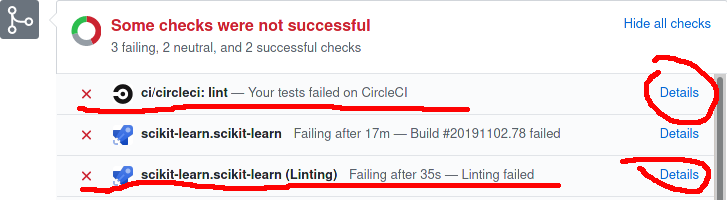
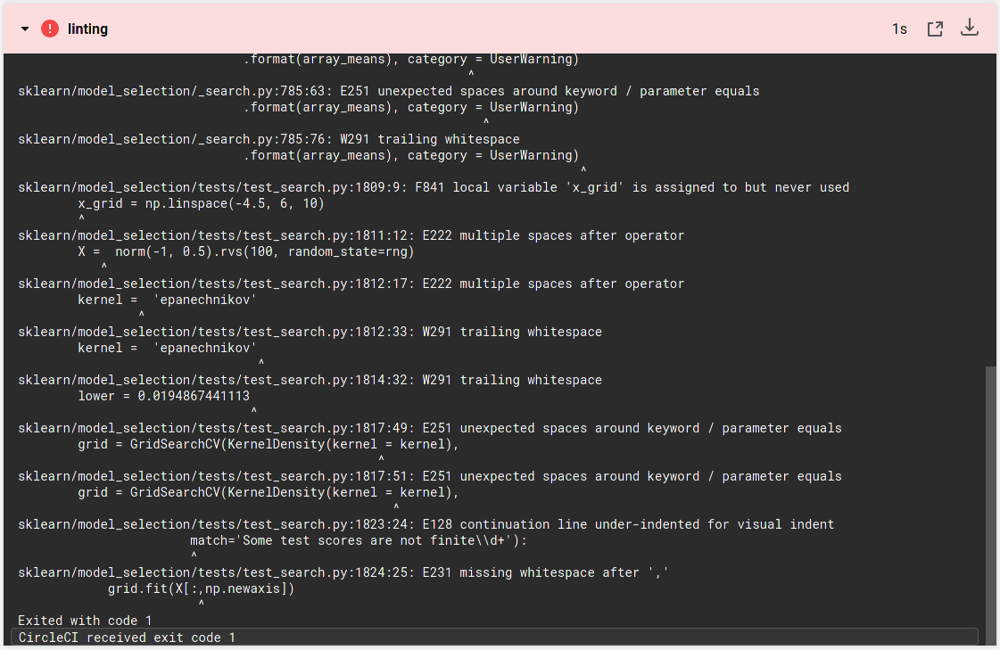

# Continuous Integration

[Continuous integration](https://en.wikipedia.org/wiki/Continuous_integration) (CI)
is the practice of merging all developers' working copies to a shared mainline several times a day.

scikit-learn implement [different strategies](https://scikit-learn.org/stable/developers/contributing.html#continuous-integration-ci) of Continuous Integration
- Azure pipelines are used for testing scikit-learn on Linux, Mac and Windows, with different dependencies and settings.
- CircleCI is used to build the docs for viewing, for linting with flake8, and for testing with PyPy on Linux

In both cases a preliminary [linting](https://en.wikipedia.org/wiki/Lint_(software)) check is applied: if the lint fails,
build checks are not performed, in order to economise computing resources.

Clicking on the Details link will expand the reasons of the failure

