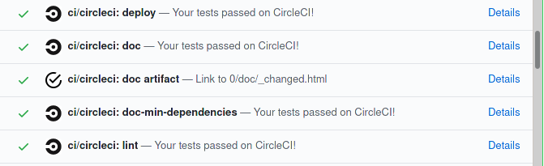

# Continuous Integration

[Continuous integration](https://en.wikipedia.org/wiki/Continuous_integration) (CI)
is the practice of merging all developers' working copies to a shared mainline several times a day.

scikit-learn implement [different strategies](https://scikit-learn.org/stable/developers/contributing.html#continuous-integration-ci) of Continuous Integration
- [Azure pipelines](https://azure.microsoft.com/en-us/services/devops/pipelines/) are used for building and testing scikit-learn on Linux, Mac and Windows, with different dependencies and settings.
- [CircleCI](https://circleci.com/) is used to build the docs for viewing and for testing with PyPy on Linux.

## Lint checks

In both cases a preliminary [linting](https://en.wikipedia.org/wiki/Lint_(software)) check is applied: if the lint fails,
build checks are not performed, in order to economise computing resources.

Failing checks are visible at the end of the Pull Request page.


Clicking on the [Details](https://app.circleci.com/pipelines/github/scikit-learn/scikit-learn/jobs/81249) link will expand
the reasons of the failure.

<a href="https://app.circleci.com/pipelines/github/scikit-learn/scikit-learn/jobs/81249" target="_blank">
  
</a>

The log file tells you where the lint issues are: the list of the flake8 errors is available in the flake8
[documentation](https://flake8.pycqa.org/en/latest/user/error-codes.html).

In our case:
- `sklearn/model_selection/_search.py`:785:61: E251 unexpected spaces around keyword / parameter equals, means that
  line 785, column 61 of the file `sklearn/model_selection/_search.py`
  ```
  .format(array_means), category = UserWarning)
  ```
  should become
  ```
  .format(array_means), category=UserWarning)
  ```
- `sklearn/model_selection/_search.py`:785:76: W291 trailing whitespace, means that line 785, column 76 there is a trailing
  space at the end of the line that should be removed.
- `sklearn/model_selection/tests/test_search.py`:1809:9: F841 local variable 'x_grid' is assigned to but never used, means
  that `x-grid` assignement might be removed.
- `sklearn/model_selection/tests/test_search.py`:1812:17: E222 multiple spaces after operator, means that
  ```
  kernel =  'epanechnikov' 
  ```
  should become
  ```
  kernel = 'epanechnikov'
  ```
- `sklearn/model_selection/tests/test_search.py`:1823:24: E128 continuation line under-indented for visual indent, means that
  the code
  ```
  with pytest.warns(UserWarning,
                 match='Some test scores are not finite\\d+'):
  ```
  should become
  ```
  with pytest.warns(UserWarning,
                    match='Some test scores are not finite\\d+'):
  ```
- `sklearn/model_selection/tests/test_search.py`:1824:25: E231 missing whitespace after ',', means that
  ```
  grid.fit(X[:,np.newaxis])
  ```
  should become
  ```
  grid.fit(X[:, np.newaxis])
  ```


To locally check the code you changed, you can run the following command:
``
git diff upstream/master -u -- "*.py" | flake8 --diff
``

## Documentation

A number of checks are performed during the [build of the documentation](https://scikit-learn.org/stable/developers/contributing.html#documentation)



After the [lint](https://github.com/scikit-learn/scikit-learn/blob/98f0b832f8888ab2dd3a143ddd09525dd11f0479/.circleci/config.yml#L89) (1)
the documentation [build](https://github.com/scikit-learn/scikit-learn/blob/98f0b832f8888ab2dd3a143ddd09525dd11f0479/.circleci/config.yml#L49) (2) process starts.
The [deploy](https://github.com/scikit-learn/scikit-learn/blob/98f0b832f8888ab2dd3a143ddd09525dd11f0479/.circleci/config.yml#L118) (3) step is meant to deploy the preview of the documentation for rendering checks.
The [doc artifact](https://github.com/scikit-learn/scikit-learn/blob/98f0b832f8888ab2dd3a143ddd09525dd11f0479/.circleci/artifact_path) (4) link list the documentation pages that have been modified by the pull request.

Those three steps often fail at the same time: if the artifact links are available,failures are probably due to sphinx
warnings, detailed in the doc artifact page.
If artifacts are not available, the build itself has failed: this can be due for example to exceptions in the
[example scripts](https://github.com/scikit-learn/scikit-learn/tree/master/examples).
Sometimes this is due to CircleCI system failures (see for example [this case](https://app.circleci.com/pipelines/github/maikia/scikit-learn/128/workflows/50aac418-6e87-4f10-98e8-4d5c5b5df460/jobs/328/steps)),
in that case it can be useful to re-trigger the build with an empty commit, with the following commands:
```
$ git commit --allow-empty -m "Trigger CI build."
$ git push origin <my_branch>
```

The [doc-min-dependencies](https://github.com/scikit-learn/scikit-learn/blob/98f0b832f8888ab2dd3a143ddd09525dd11f0479/.circleci/config.yml#L4) (5) step builds the documentation with minimal versions dependencies.
A failure at this point means that modifications are not compatible with older versions of the dependencies and some
too recent functions should be replaced.

## scikit-learn building and testing

