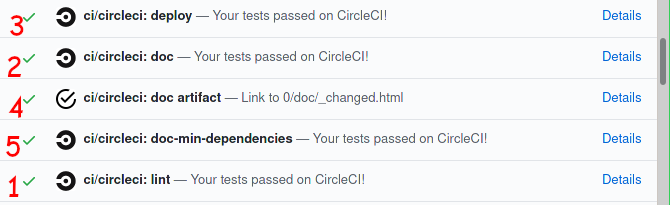

# Continuous Integration

[Continuous integration](https://en.wikipedia.org/wiki/Continuous_integration) (CI)
is the practice of merging all developers' working copies to a shared mainline several times a day.

scikit-learn implement [different strategies](https://scikit-learn.org/stable/developers/contributing.html#continuous-integration-ci) of Continuous Integration
- [Azure pipelines](https://azure.microsoft.com/en-us/services/devops/pipelines/) are used for testing scikit-learn on Linux, Mac and Windows, with different dependencies and settings.
- [CircleCI](https://circleci.com/) is used to build the docs for viewing and for testing with PyPy on Linux.

## Lint checks

In both cases a preliminary [linting](https://en.wikipedia.org/wiki/Lint_(software)) check is applied: if the lint fails,
build checks are not performed, in order to economise computing resources.

Failing checks are visible at the end of the Pull Request page.

Clicking on the [Details](https://app.circleci.com/pipelines/github/scikit-learn/scikit-learn/jobs/81249) link will expand
the reasons of the failure.

The log file tells you where the lint issues are.
To locally check the code that you changed, you can run the following command:
``
git diff upstream/master -u -- "*.py" | flake8 --diff
``

## Documentation

A number of checks are performed during the [build of the documentation](https://scikit-learn.org/stable/developers/contributing.html#documentation)

After the lint (1) the documentation build process start.
