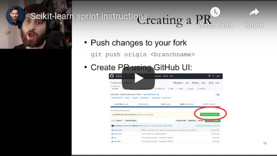
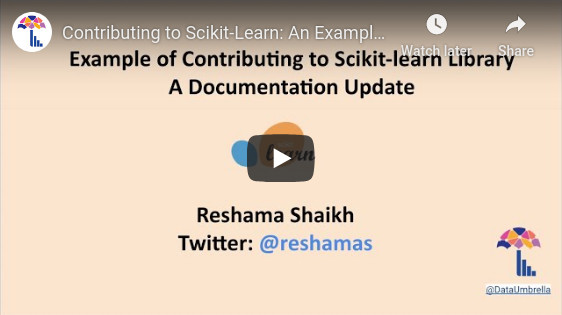

# Consortium Remote Sprint

_2020, June 23-26_

### Resources for beginners

#### Crash course in contributing to open source projects

by [Andreas Mueller](https://github.com/amueller)

#### Example of Submitting a Pull request to scikit-learn

by [Reshama Shaikh](https://github.com/reshamas/)

